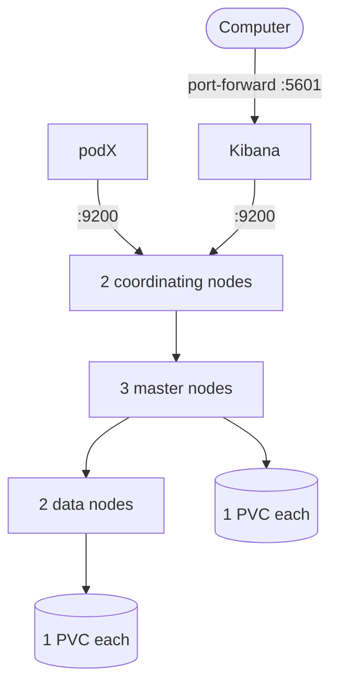

# ansible-kubernetes misc

## Elasticsearch

This helm chart comes from [github.com/bitnami/charts](https://github.com/bitnami/charts/tree/master/bitnami/elasticsearch).

Elasticsearch install:

    cd helm/elasticsearch/
    helm install gros-elastic .

It will install this elasticsearch architecture :

After installation, to access kibana:

    kubectl port-forward --namespace default svc/gros-elastic-kibana 5601:5601

Then open your web browser tp [http://localhost:5601/app/home](http://localhost:5601/app/home).
Or open persistent access with an Ingress or NodePort.

## Kafka

The helm chart used comes from [github.com/bitnami/charts](https://github.com/bitnami/charts/tree/master/bitnami/elasticsearch).

Installation:

    kubectl apply -f https://raw.githubusercontent.com/rancher/local-path-provisioner/master/deploy/local-path-storage.yaml
    helm repo update
    cd helm/kafka
    helm install -f values.yaml kafkop bitnami/kafka

Port-forward allowing your local program to access the cluster:

    kubectl port-forward pods/kafkop-kafka-0 9093:9093

Kafka administration:

    # create an administration pod
    kubectl run kafkop-kafka-client --restart='Never' --image docker.io/bitnami/kafka:3.3.1-debian-11-r22 --namespace default --command -- sleep infinity
    # enter into it, kafka scripts are available
    kubectl exec --tty -i kafkop-kafka-client --namespace default -- bash
    # create the topic used by the app
    kafka-topics.sh --bootstrap-server kafkop-kafka-0.kafkop-kafka-headless.default.svc.cluster.local:9092 --topic message-log --create --partitions 3 --replication-factor 1

More kafka cli tutorial here: [Conduktor kafkademy](https://www.conduktor.io/kafka/kafka-cli-tutorial).

Then you can run this simple program:

    cd app/
    go run main.go
